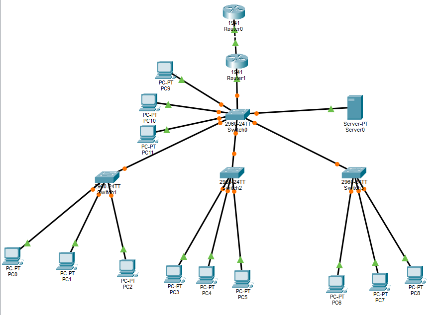

# Enterprise Multi-VLAN Network

<p align="center">
  
</p>

<p align="center">
  <b>Cisco Packet Tracer Enterprise Network Project</b>
</p>

<p align="center">
  VLANs • Trunking • Inter-VLAN Routing • DHCP • Static Routing • Server Connectivity
</p>

---

## 📌 Project Overview

This project demonstrates the design and configuration of an enterprise-style network using **Cisco Packet Tracer**.

The network is divided into multiple departments using **VLANs**. Trunk links are used to carry multiple VLANs between switches, while **Router-on-a-Stick** provides communication between different VLANs.

The project also includes:

- DHCP
- Static routing
- Router-to-router communication
- `/30` subnetting
- Dedicated server VLAN
- End-to-end connectivity
- Network troubleshooting

---

## 🎯 Project Objectives

The main objectives of this project are:

- Create and configure multiple VLANs
- Assign switch ports to appropriate VLANs
- Configure trunk links
- Configure Router-on-a-Stick
- Enable communication between different VLANs
- Configure DHCP for automatic IP assignment
- Configure a router-to-router connection
- Use `/30` subnetting between routers
- Configure static routing
- Configure a dedicated server VLAN
- Verify end-to-end connectivity
- Practice network troubleshooting

---

## 🏢 Network Departments

| VLAN | Department | Network | Gateway |
|------|------------|---------|---------|
| VLAN 10 | HR | 192.168.10.0/24 | 192.168.10.1 |
| VLAN 20 | IT | 192.168.20.0/24 | 192.168.20.1 |
| VLAN 30 | Finance | 192.168.30.0/24 | 192.168.30.1 |
| VLAN 40 | Management | 192.168.40.0/24 | 192.168.40.1 |
| VLAN 50 | Servers | 192.168.50.0/24 | 192.168.50.1 |

---

## 🖥️ Network Devices

The network contains:

- **2 × Cisco 1941 Routers**
- **4 × Cisco 2960 Switches**
- **12 × PCs**
- **1 × Server**
- Copper Straight-Through cables
- Copper Cross-Over cable

---

## 🗺️ Network Topology



---

## 🔌 Physical Topology

```text
                         Router0
                            |
                            |
                       10.0.0.1/30
                            |
                       10.0.0.2/30
                            |
                         Router1
                            |
                           G0/0
                            |
                         Core-SW
              _____________|_____________
             |             |             |
             |             |             |
            SW1           SW2           SW3
             |             |             |
          PC0 PC1 PC2   PC3 PC4 PC5   PC6 PC7 PC8
             |
             |
        PC9  PC10  PC11
             |
           Server
```

---

# 🔹 VLAN Configuration

## What is a VLAN?

A **VLAN (Virtual Local Area Network)** logically separates devices into different networks even when they are connected to the same physical switching infrastructure.

## Why are VLANs used?

VLANs are used to:

- Separate departments
- Reduce broadcast traffic
- Improve network organization
- Improve network security
- Make network management easier

## VLANs Used in This Project

```text
VLAN 10 → HR
VLAN 20 → IT
VLAN 30 → Finance
VLAN 40 → Management
VLAN 50 → Servers
```

## VLAN Network Plan

| VLAN | Department | Network |
|------|------------|---------|
| 10 | HR | 192.168.10.0/24 |
| 20 | IT | 192.168.20.0/24 |
| 30 | Finance | 192.168.30.0/24 |
| 40 | Management | 192.168.40.0/24 |
| 50 | Servers | 192.168.50.0/24 |

Detailed configuration:

[📄 View VLAN Configuration](documentation/vlan-configuration.md)

---

# 🔹 Access Ports

Access ports connect end devices such as PCs to a specific VLAN.

For example:

```text
SW1 Fa0/1 → PC0 → VLAN 10
SW1 Fa0/2 → PC1 → VLAN 20
SW1 Fa0/3 → PC2 → VLAN 30
```

Other switches also have their PC ports assigned to the appropriate VLAN.

### Why Access Ports Are Used

An access port normally carries traffic for a single VLAN.

This allows each PC to belong to the correct department network.

---

# 🔹 Trunking

## What is Trunking?

A **trunk link** allows multiple VLANs to travel through a single physical connection.

In this project, trunk links connect the switches to the Core-SW and connect the Core-SW to Router1.

## Configured Trunk Links

```text
SW1 Fa0/24 ↔ Core-SW Fa0/2

SW2 Fa0/24 ↔ Core-SW Fa0/3

SW3 Fa0/24 ↔ Core-SW Fa0/4

Core-SW Fa0/1 ↔ Router1 G0/0
```

## Allowed VLANs

```text
10, 20, 30, 40, 50
```

## Why Trunking Is Used

Without trunking, each VLAN would require a separate physical connection.

With trunking, multiple VLANs can share the same link.

---

# 🔹 Inter-VLAN Routing

## What is Inter-VLAN Routing?

Devices in different VLANs are placed in different IP networks.

A Layer 3 device such as a router is required for communication between those networks.

This project uses **Router-on-a-Stick**.

## Router1 Subinterfaces

| Interface | VLAN | IP Address |
|-----------|------|------------|
| G0/0.10 | VLAN 10 | 192.168.10.1 |
| G0/0.20 | VLAN 20 | 192.168.20.1 |
| G0/0.30 | VLAN 30 | 192.168.30.1 |
| G0/0.40 | VLAN 40 | 192.168.40.1 |
| G0/0.50 | VLAN 50 | 192.168.50.1 |

Each subinterface acts as the default gateway for its VLAN.

### Example

```text
PC in VLAN 10
      |
      ↓
192.168.10.1
      |
   Router1
      |
      ↓
192.168.20.1
      |
      ↓
PC in VLAN 20
```

Detailed configuration:

[📄 View Router Configuration](documentation/router-configuration.md)

---

# 🔹 DHCP

## What is DHCP?

**DHCP (Dynamic Host Configuration Protocol)** automatically provides network configuration to client devices.

Instead of manually configuring every PC, the DHCP server/router assigns the required information automatically.

## DHCP Provides

DHCP provides:

- IP address
- Subnet mask
- Default gateway
- DNS server

## DHCP Pools

The following DHCP pools were configured on Router1:

```text
HR
IT
FINANCE
MANAGEMENT
```

## Example DHCP Configuration

```text
Network:         192.168.10.0/24
Default Gateway: 192.168.10.1
DNS Server:      8.8.8.8
```

## DNS Server

The DHCP configuration provides:

```text
8.8.8.8
```

as the DNS server.

The PC can ask the DNS server to translate domain names such as:

```text
google.com
```

into an IP address.

Detailed configuration:

[📄 View DHCP Configuration](documentation/dhcp-configuration.md)

---

# 🔹 Router-to-Router Communication

Router0 and Router1 are connected using a `/30` network.

## IP Addressing

| Router | Interface | IP Address |
|--------|-----------|------------|
| Router0 | G0/1 | 10.0.0.1/30 |
| Router1 | G0/1 | 10.0.0.2/30 |

## Network

```text
10.0.0.0/30
```

## Why `/30` Is Used

A `/30` subnet provides:

```text
Network Address   → 10.0.0.0
Usable IP         → 10.0.0.1
Usable IP         → 10.0.0.2
Broadcast Address → 10.0.0.3
```

Therefore, the two usable IP addresses are perfect for a point-to-point connection between two routers.

---

# 🔹 Static Routing

## What is Static Routing?

Static routing means manually configuring a route to a remote network.

In this project, static routes are used to allow Router0 and Router1 to reach networks on the opposite side.

## Router1 Route

Router1 has a route toward Router0's Loopback network:

```text
Destination Network:
10.10.10.0/24
```

Next hop:

```text
10.0.0.1
```

## Router0 Default Route

Router0 uses a default route through Router1:

```text
Destination:
0.0.0.0/0
```

Next hop:

```text
10.0.0.2
```

---

# 🔹 Loopback Interface

Router0 contains a Loopback0 interface.

## Loopback Configuration

```text
Interface:    Loopback0
IP Address:   10.10.10.1
Subnet Mask:  255.255.255.0
```

The Loopback interface provides a logical interface that remains independent of a physical Ethernet connection.

It is used in this project to demonstrate routing between Router0 and Router1.

---

# 🔹 Server Configuration

The server belongs to **VLAN 50**.

## Server IP Configuration

```text
IP Address:      192.168.50.10
Subnet Mask:     255.255.255.0
Default Gateway: 192.168.50.1
```

The server uses a **static IP address**.

This allows network devices to consistently reach the server using:

```text
192.168.50.10
```

---

# 🔍 Network Verification

After configuration, the network was verified using Cisco IOS commands and PC ping tests.

## Switch Verification

```text
show vlan brief
show interfaces trunk
show interfaces status
```

### `show vlan brief`

Used to verify:

- VLANs
- VLAN names
- Access ports
- VLAN membership

### `show interfaces trunk`

Used to verify:

- Trunk ports
- Allowed VLANs
- Trunk status

---

## Router Verification

```text
show ip interface brief
show ip route
show ip dhcp binding
show ip dhcp pool
```

### `show ip interface brief`

Used to check:

- Interface status
- IP addresses
- Up/down state

### `show ip route`

Used to check:

- Connected networks
- Static routes
- Routing information

### `show ip dhcp binding`

Used to check:

- DHCP-assigned IP addresses
- Client MAC addresses

---

## PC Verification

On a PC:

```text
ipconfig
```

Used to verify:

- IP address
- Subnet mask
- Default gateway
- DNS server

Ping can be used to test connectivity:

```text
ping <destination-ip>
```

Detailed verification:

[📄 View Network Verification](documentation/verification.md)

---

# ✅ Connectivity Tests

The following connectivity tests were successfully completed.

| Source | Destination | Purpose | Result |
|--------|-------------|---------|--------|
| PC0 | 192.168.10.1 | VLAN gateway | ✅ Successful |
| PC0 | 192.168.20.1 | Inter-VLAN routing | ✅ Successful |
| PC0 | 192.168.50.10 | Server connectivity | ✅ Successful |
| PC0 | 10.10.10.1 | End-to-end routing | ✅ Successful |
| Router0 | 10.0.0.2 | Router-to-router link | ✅ Successful |
| Router1 | 10.0.0.1 | Router-to-router link | ✅ Successful |

---

# 🧪 Troubleshooting

When communication fails, the following areas should be checked.

## 1. PC Configuration

Check:

- IP address
- Subnet mask
- Default gateway
- DNS server

Command:

```text
ipconfig
```

---

## 2. VLAN Assignment

Check whether the correct switch port belongs to the correct VLAN.

Command:

```text
show vlan brief
```

---

## 3. Trunk Configuration

Check whether trunk links are working correctly.

Command:

```text
show interfaces trunk
```

---

## 4. Router Interfaces

Check whether router interfaces are up.

Command:

```text
show ip interface brief
```

---

## 5. Router Subinterfaces

Check the Router-on-a-Stick configuration.

Verify:

```text
G0/0.10
G0/0.20
G0/0.30
G0/0.40
G0/0.50
```

---

## 6. DHCP

Check DHCP pools and assigned addresses.

Commands:

```text
show ip dhcp pool
show ip dhcp binding
```

---

## 7. Routing Table

Check whether the router knows the destination network.

Command:

```text
show ip route
```

---

## 8. Connectivity

Use ping to test communication.

```text
ping <destination-ip>
```

---

# 📁 Project Structure

```text
Enterprise-Multi-VLAN-Network/
│
├── Enterprise-Multi-VLAN-Network.pkt
├── LICENSE
├── README.md
│
├── images/
│   └── topology.png
│
└── documentation/
    ├── vlan-configuration.md
    ├── router-configuration.md
    ├── dhcp-configuration.md
    └── verification.md
```

---

# 📚 Documentation

Detailed project documentation:

- [📄 VLAN Configuration](documentation/vlan-configuration.md)
- [📄 Router Configuration](documentation/router-configuration.md)
- [📄 DHCP Configuration](documentation/dhcp-configuration.md)
- [📄 Network Verification](documentation/verification.md)

---

# 🧠 Skills Learned

Through this project, I practiced:

- Cisco Packet Tracer
- Cisco IOS
- VLAN configuration
- VLAN segmentation
- Access ports
- Trunking
- 802.1Q
- Router-on-a-Stick
- Inter-VLAN routing
- DHCP
- DNS configuration
- IPv4 addressing
- `/30` subnetting
- Static routing
- Default routing
- Loopback interfaces
- Server networking
- Network troubleshooting
- Network verification

---

# 🛠️ Tools Used

| Tool | Purpose |
|------|---------|
| Cisco Packet Tracer | Network simulation |
| Cisco IOS | Router and switch configuration |
| GitHub | Project documentation and version control |
| Markdown | Documentation |

---

# 🎓 Learning Outcome

This project helped me understand how multiple networking technologies work together in an enterprise environment.

The complete learning flow was:

```text
VLANs
   ↓
Access Ports
   ↓
Trunking
   ↓
Router-on-a-Stick
   ↓
Inter-VLAN Routing
   ↓
DHCP
   ↓
Router-to-Router Communication
   ↓
Static Routing
   ↓
Server Connectivity
   ↓
Network Verification
   ↓
Troubleshooting
```

This project helped me move from individual networking concepts to understanding how multiple technologies work together as one complete network.

---

# 👨‍💻 Author

## Shamshuddin Sam

**Electronics & Communication Engineer**

**Network Engineer Trainee**

---

<p align="center">
  ⭐ Thanks for visiting this project!
</p>
